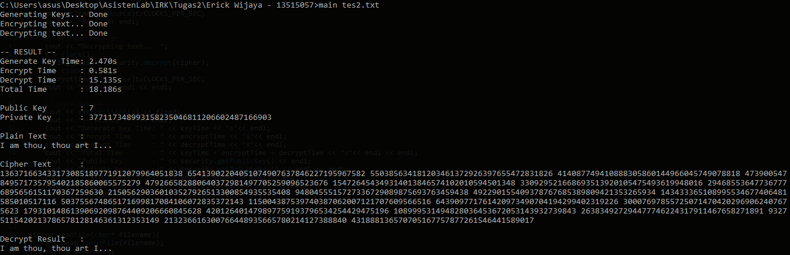

# RSA and Big Integer Implementation

## Overview
A simple RSA that can encrypt plaintext into ciphertext and decrypt it back to retrieve the text. Written in C++ languange, this project consists of Big Integer Library and RSA. The Big Integer Library can be used to create and operate very large integers. 

## Run
To run the application, you will need an input file (text file) that contains message needed to be encrypted. Run the cmd or shell and type the command below.

```
./main <your-file.txt>
```
If you are using windows, you may need to use "main" instead of "./main".

## Explanation
The Big Integer class uses std::vector to store the digits of integer. The Big Integer class has methods that overload c++ operators like operator +, -, /, %, ++, +=, and so on. Karatsuba Multiplication Algorithm is used to implement multiplication operator. Random probable prime numbers are generated with Miller-Rabin Primality Test Algorithm.

The RSA class has two primary methods and a constructor. The constructor handles generating the public and private key. First, the constructor generates two random probable prime numbers (p and q). The prime numbers are used to calculate n = p * q. After that, the euler phi function is calculated with formula eulerphi = (p - 1) * (q - 1). After that, pick a number e that is coprime with the eulerphi. The number e is the public key. To generate the private key d, calculate with e^-1 mod eulerphi (this can be done with Extended Euclidean Algorithm implemented in gcdExtended method). In this state the program have generated two keys, the public key e and the private key d. 

To encrypt a plaintext, the plaintext is converted into its ASCII values. Each values (ci) will be encrypted to create values for ciphertext (di). For each ci, calculate di = ci^e mod n. All the di values combined is the ciphertext. To decrypt the ciphertext back to plaintext, calculate ci = di^d mod n. All the ci values are converted back from ASCII to characters. To make the encryption and decryption safer, ci must be multiplied by random multiple of 256 before calculating di. After the decryption, the results must be divided by 256 to get the remainders. The remaindes are the ASCII values that are converted back to plaintext.

Please note that this program is created for educational purpose and not supposed to be used in practical uses.

## Compile
To compile the code, use this command below.
```
g++ src/biginteger.cpp src/rsa.cpp main.cpp -o main
```

## Screenshot



