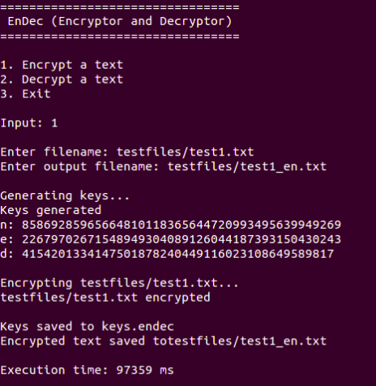
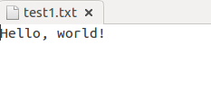
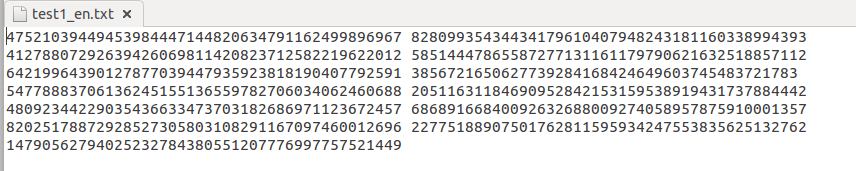
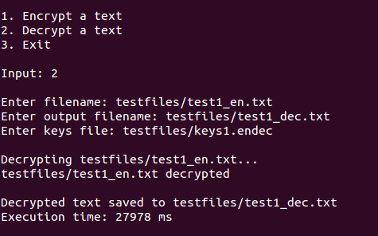
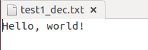

# EnDec

EnDec is an application to encrypt and/or decrypt a text file using [RSA Algorithm](https://en.wikipedia.org/wiki/RSA_(cryptosystem)) written in Java.

This application uses BigInteger library written by the author instead of BigInteger library provided by Java (java.math.BigInteger).
The primality tested used in the BigInteger library is [Miller-Rabin test](https://en.wikipedia.org/wiki/Miller%E2%80%93Rabin_primality_test).

## How to Run

Download [EnDec.jar](https://github.com/jordhy97/Tugas2-Ca-IRK2015/blob/master/Jordhy%20Fernando%20-%2013515004/EnDec.jar) and run it.

## Application Features and Screenshots

1. Encryption
The application will ask the user for the text file to be encrypted and output filename, then it will generate the keys needed in RSA algorithm. The keys will be saved in a file named keys.endec in the order n, e, d.
After that it will encrypt the text by transforming each character in the text into its ASCII representation and multiply the ASCII by a random number multiple of 256 (for further protection), then using the RSA encryption algorithm (c = me (mod n)).

2. Decryption
The application will ask the user for the encrypted text file, keys file, and output filename, then it will decrypt the text by using the RSA decryption algorithm (m = cd (mod n)) and modulo by 256 to return it to its ASCII representation.

## Test Files and Results
The test files and their results can be seen in the testfiles folder.